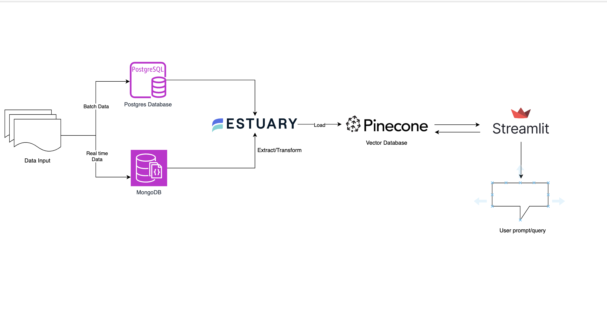

# Unified Data Integration to Enable AI (RAG)

This project showcases how you can unify and integrate different real-time and batch data sources and use them to create a RAG system using a real life usecase.

## Prerequisites
set up the following tools on your device:
1. Clone the GitHub repo that contains all the source code for this tutorial:
``` git clone https://github.com/estuary/examples.git ```
2. Sign up for Estuary account for free.
3. Install Docker on your desktop. You can follow this tutorial. This project contains a Docker-based environment to help you easily set up data sources and load data into them. 
4. Sign up for a ngrok account. Ngrok is a lightweight tool that exposes your Postgres database container running on the local host to the internet.
5. Download MongoDB compass and create a free MongoDB Atlas account. 
6. Set up a Pinecone account. Pinecone has a free version that you can use. This will be our destination vector database.
7. Set up an OpenAI account. We will use OpenAI’s LLM model to evaluate the RAG embeddings we create and get answers to user prompts.

## Architecture:



## Building the pipeline
See blog post for details: [blog url](url)